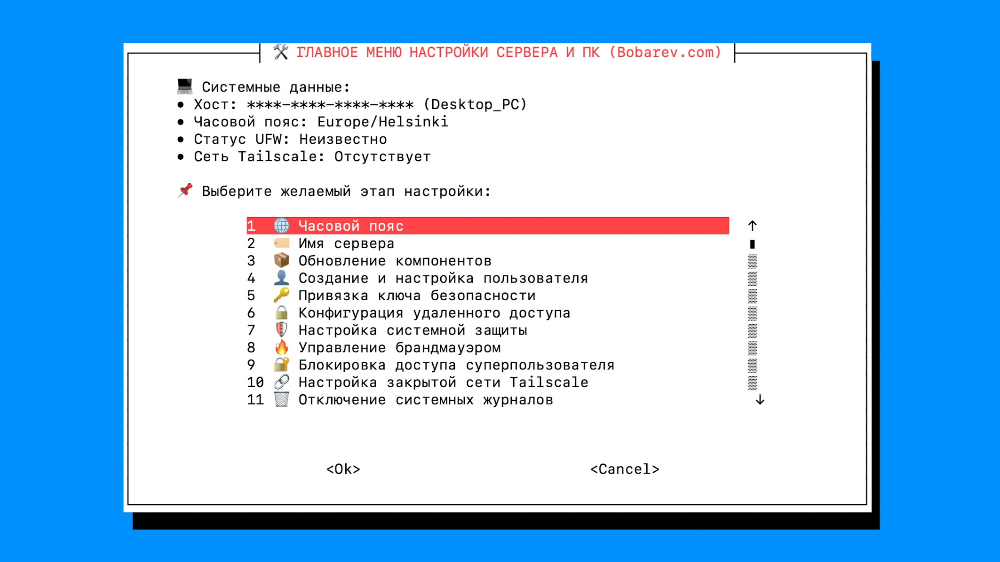

🛠️ Универсальный скрипт для настройки VPS “с нуля” и до “запуска”. Установленный Tailscale в режиме Exit-Node и Gro-оптимизацией позволяет маршрутизировать трафик по желаемым для Вас направлениям. Учтено множество факторов работы Linux для максимальной безопасности. Оптимизация как VPS-серверов, PC так и одноплатных компьютеров (SBC).

В качестве рекомендаций: | [VPS1](https://apt.bobarev.com) | [VPS2](https://apt2.bobarev.com) |

###### 🚀 Быстрый запуск в одну команду. Запустите от имени `root` в терминале вашего сервера или ПК:
```
bash <(curl -sSL https://raw.githubusercontent.com/michaelbobarev/bobarev_shell/main/bobarev_shell.sh)
```
###### Меню



📋 Список доступных модулей

🌐 Базовая система и сервер

- Часовой пояс - установка актуального системного часового пояса с точной синхронизациеи времени.
- Имя сервера — автоматическая установка имени системы с корректной привязкой в /etc/hosts.
- Обновление компонентов - апдейт пакетов, активация unattended-upgrades и предотвращение конфликтов ZRAM.
- Создание и настройка пользователя — создание sudo-пользователя с паролем и опциональным NOPASSWD.
- Привязка ключа безопасности — привязка публичных ключей с автоматическим выставлением прав на .ssh/authorized keys.
- Конфигурация удаленного доступа — смена порта, блокировка root пользователя, защита от замусоривания и возможность ограничения доступа строго через сеть Tailscale.
- Настройка системной защиты — подгрузка BBR, оптимизация FQ, TCP FastOpen, RFC1337 и защита sysctl от спуфинга и ICMP-атак.
- Управление брандмауэром — конфигурация файрвола, защита портов и изоляция SSH внутри туннеля Tailscale.
- Блокировка доступа суперпользователя — полная блокировка записи root при наличии альтернативного sudo-пользователя.
- Настройка закрытой сети Tailscale — авто-установка меш-сети, анонс Exit-Node/LAN-подсетей, стелс-режим, GRO-ускорение UDP и веб-интерфейс управления Tailscale Web.
- Отключение системных журналов — перевод journald в режим Storage=none, маскирование rsyslog/auditd и очистка /var/log для сохранения ресурса накопителей.
- Оптимизация памяти — защита ресурса Flash (MicroSD/eMMC/SSD) через noatime, commit=120, выравнивание dirty_writeback_centisecs и перенос временных директорий в tmpfs.
- Управление файлом подкачки — интерактивное создание, изменение размера или полное удаление файла SWAP.

🖥️ PC, роутер и диагностика

- Утилиты для ПК и автозапуск — быстрая установка трей-апплетов сети, звука, bluetooth и батареи для графических оболочек.
- Сброс видеовыхода HDMI — автоматический перезапуск видеовыхода в LightDM/xrandr для устранения проблем с внешними мониторами.
- Анализ времени загрузки — детальный анализ старта systemd c сохранением текстового отчёта и SVG-графика загрузки.
- Интеллектуальный аудит системы — интеллектуальная проверка системы, параметров ядра, безопасности SSH/UFW, логирования и сети Tailscale.
- Режим локального маршрутизатора — превращение SBC (NanoPi/Raspberry) в LAN-шлюз c DHCP (dnsmasq), DNS, MSS Clamping, защитой от конфликта подсетей и роутингом через Tailscale Exit-Node.

👤 Автор

Michael Bobarev | https://www.bobarev.com
